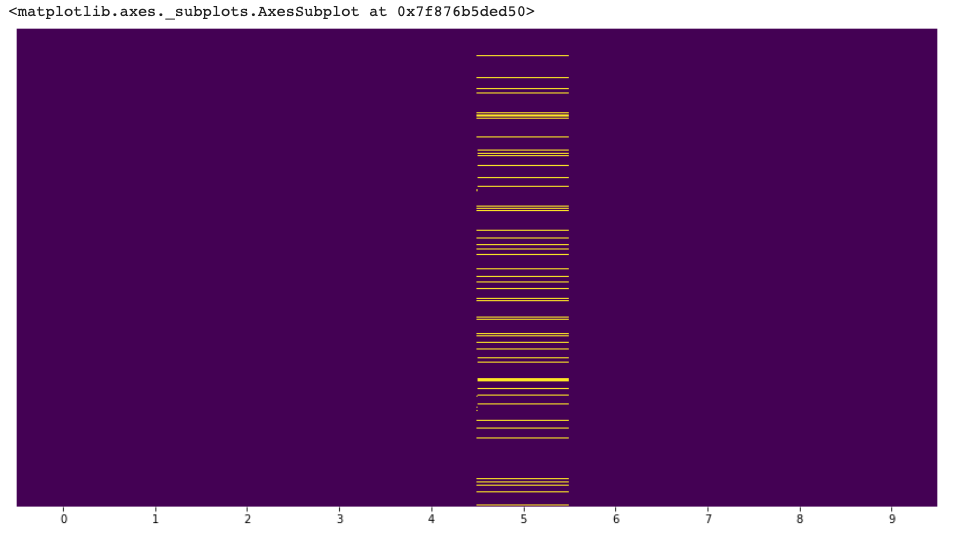

# Churn Prediction USA TODAY (GANNETT)'s Coding Challenge Problem

 

 

 

Churning occurs when customers leave and stop buying your product or using your service during a defined time frame. 

Random Forest and Decision Tree models were used for predicting churning. The dataset contains 10000 samples and 10 columns as:

- CPL_wrt_BC=change in cost per lead with respect to business category
- client_state=client's location
- duration=how long the client has been running advertising campaigns in months
- num_prods=how many distinct advertising products the client has bought
- calls=number of calls received
- CPL_wrt_self=change in client's cost per lead in the past three months
- churn=target column (0=retention | 1=churn)
- avg_budget=average monthly budget spent on advertising campaigns
- BC=client's business category
- clicks=number of clicks received

There were missing data on column  5th column which were imputed using mean values. 

 

 

 

The class imbalance was about 

0: 8000
1: 2000

 

 

 

Normally, it is advised to either undersample or collect more data. But for this analysis, I moved ahead to come back after model performance analysis if necessary. The Random Forest ROC (shown first) and Decision Tree (shown second) gave reasonable results. 

 

 

 

 

 

 
